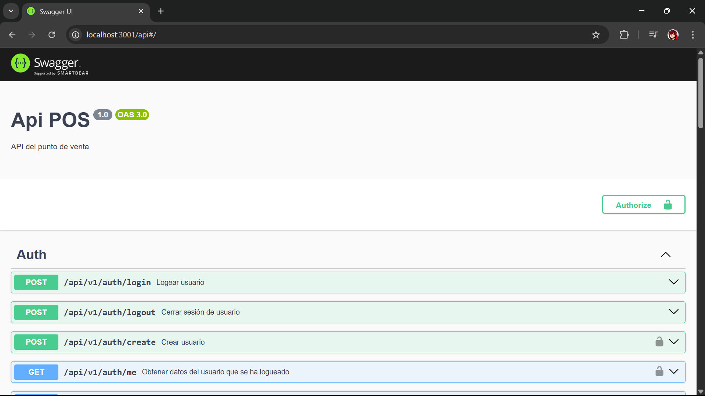

<p align="center">
  <a href="http://nestjs.com/" target="blank"></a>
</p>

# Sistema de Punto de Venta Ventry

Hola, este es backend de un sistema de punto de venta desarrollado con NestJS. El objetivo es proporcionar una solución completa para la gestión de ventas e inventario.  
La licencia de este proyecto te permite usarlo de forma gratuita, ya sea para fines personales o educativos. Sin embargo, si deseas utilizarlo con fines comerciales, se requiere una licencia comercial. Para más detalles, contáctame personalmente [manuelvgc2233@gmail.com](mailto:manuelvgc2233@gmail.com), si deseas más información consulta el archivo LICENSE del repositorio.

### Índice
[Versión en inglés](#documentation)  
[Instalación](#instalación)  
[Documentación de Open API](#documentación-de-open-api)  
[Módulos del Proyecto](#módulos-del-proyecto)  
[Carpetas de Recursos](#carpetas-de-recursos)  
[Manejo de autenticación de usuarios](#manejo-de-autenticación-de-usuarios)  
[Requisitos](#requisitos)  
[Estructura de la base de datos](#estructura-de-la-base-de-datos)

## Requisitos
El proyecto se ha desarrollado utilizando la siguiente versión de Node.js, para evitar problemas de compatibilidad, asegúrate de tener instalada la misma versión o una superior:
- **Node.js**: v22.13.1

## Instalación
1. Clona el repositorio:
    ```bash
    git clone https://github.com/VictorMGCYT/POS-backend.git
    ```
2. Navega al directorio del proyecto:
    ```bash
    cd POS-backend
    ```
3. Instala las dependencias:
    ```bash
    npm install
    ```
4. Renombra el archivo `.env.template` a `.env` y configura las variables de entorno según tus necesidades.

5. Ejecutar el comando de docker para crear la imagen base de datos, revisa el archivo `docker-compose.yaml` para más detalles:
    ```bash
    docker compose up -d
    ```
6. Inicia la aplicación:
    ```bash
    npm run start:dev
    ```
7. Accede a la aplicación en tu navegador en `http://localhost:3001`.

## Documentación de Open API
Todos los endpoints de la API están documentados utilizando Swagger. Puedes acceder a la documentación en `http://localhost:3001/api`, una vez que hayas ejecutado el proyecto.



Puedes ver ejemplos de las peticiones y respuestas, así como los parámetros requeridos para cada endpoint.

## Módulos del Proyecto
- **Auth**: Maneja la autenticación y autorización de usuarios, además de permitir el registro y la gestión de los mismos.
- **Products**: Permite la gestión de productos, incluyendo creación, actualización y eliminación.
- **Sales**: Registra y gestiona las ventas realizadas en el sistema.
- **Sale-Items**: Maneja los artículos individuales dentro de una venta, para llevar el registro de cada transacción.
- **Printer**: Maneja la impresora de la librería PDFmake, permitiendo la generación de los reportes en formato PDF.
- **Reports**: Contiene los endpoints para generar reportes de ventas, strock etc.

## Carpetas de Recursos
Dentro de `src` encontrarás las siguientes carpetas que son importantes para el funcionamiento del proyecto:
- **assets**: Contiene la carpeta de `images` dónde se encuentra el logo del sistema y que además es utilizado en los reportes. También incluye la carpeta `reports`... OJO, no confundir con el módulo `reports` que contiene los endpoint, en esta carpeta están las funciones de PDFmake qué se encargan de la estructura de los reportes.
- **utils**: Por el momento únicamente contiene la carpeta de `functions`, que incluye funciones de utilidad que pueden ser utilizadas en diferentes partes del proyecto, como formatear fechas y normalizar los nombres que provienen de la base de datos.

## Manejo de autenticación de usuarios
Para manejar la autenticación de usuarios, el proyecto utiliza JWT (JSON Web Tokens). Los usuarios pueden registrarse y luego iniciar sesión para obtener un token que les permitirá acceder a los endpoints protegidos.

Para ello se utiliza una estrategia de autenticación basada en JWT, que se configura en el módulo `AuthModule`.  
El flujo de autenticación es el siguiente:

1. **Inicio de sesión**: El usuario envía sus datos (nombre de usuario y contraseña) a través del endpoint `/auth/login`.
2. **Generación del token**: Si las credenciales son válidas, el servidor genera un token JWT y lo devuelve al usuario mediante el uso de una cookie llamada `jwt`.
3. **Acceso a endpoints protegidos**: Los endpoints que se encuentran decorados con `@Auth()` requieren que el usuario envíe el token en las cookies de la solicitus.
4. **Verificación del token**: El servidor por defecto utiliza la librería `Passport` la cuál establece por defecto una estrategia de autenticación basada en JWT. Esta estrategia verifica la validez del token en cada solicitud a los endpoints protegidos, puedes verlos en el archivo `auth/strategy/jwt.strategy.ts`.
5. **Colocación del token en la request**: La estrategia valida el token y, si es válido verifica que el usuario que contiene el `payload` del token exista en la base de datos, si es así, permite el acceso al endpoint protegido y además coloca la información del usuario en la request mediante el método `validate` de la estrategia, lo que permite acceder a los datos del usuario autenticado en los controladores.

## Estructura de la base de datos

### 1. **users** (Usuarios del sistema)

| Columna        | Tipo         | Descripción                     |
|:---------------|:-------------|:---------------------------------|
| id             | INT PK AUTO_INCREMENT | ID único del usuario. |
| username       | VARCHAR(100) | Nombre de usuario para login.    |
| password_hash  | VARCHAR(255) | Contraseña hasheada.             |
| role           | ENUM('admin', 'cajero') | Rol dentro del sistema. |
| created_at     | DATETIME     | Fecha de creación.               |

---

### 2. **products** (Productos disponibles)

| Columna        | Tipo          | Descripción                         |
|:---------------|:--------------|:------------------------------------|
| id             | INT PK AUTO_INCREMENT | ID único del producto.        |
| name           | VARCHAR(255)  | Nombre del producto.                |
| sku_code       | VARCHAR(100) NULL | Código de barras o SKU (opcional para frutas/verduras). |
| is_by_weight   | BOOLEAN       | TRUE si se vende por peso, FALSE si es por unidad. |
| unit_price     | DECIMAL(10,2) | Precio de venta **actual** (por unidad o por kilo). |
| purchase_price | DECIMAL(10,2) | Precio de compra actual (por unidad o por kilo). |
| stock_quantity | DECIMAL(10,2) | Stock disponible (puede ser decimal para kilos). |
| created_at     | DATETIME      | Fecha de creación.                  |

---

### 3. **sales** (Ventas realizadas)

| Columna        | Tipo           | Descripción                       |
|:---------------|:---------------|:----------------------------------|
| id             | INT PK AUTO_INCREMENT | ID único de venta.           |
| user_id        | INT FK → users(id) | Usuario que hizo la venta.    |
| total_amount   | DECIMAL(10,2)   | Total de la venta.               |
| total_profit   | DECIMAL(10,2)   | Total de la **ganancia** generada en esta venta. |
| payment_method | ENUM('efectivo', 'tarjeta', 'transferencia') | Método de pago usado. |
| sale_date      | DATETIME        | Fecha y hora de la venta.         |

---

### 4. **sale_items** (Productos vendidos en cada venta)

| Columna         | Tipo          | Descripción                        |
|:----------------|:--------------|:-----------------------------------|
| id              | INT PK AUTO_INCREMENT | ID único del item.            |
| sale_id         | INT FK → sales(id) | Venta a la que pertenece.      |
| product_id      | INT FK → products(id) | Producto vendido.             |
| quantity        | DECIMAL(10,2) | Cantidad vendida (piezas o kilos). |
| unit_price      | DECIMAL(10,2) | Precio de venta al momento.         |
| purchase_price  | DECIMAL(10,2) | Precio de compra al momento.        |
| subtotal        | DECIMAL(10,2) | quantity * unit_price (antes de descuentos si tuvieras). |
| profit          | DECIMAL(10,2) | (unit_price - purchase_price) * quantity |

 
## Documentation

Hello, this is the backend of a point of sale system developed with NestJS. The goal is to provide a complete solution for managing sales and inventory.
The license of this project allows you to use it for free, either for personal or educational purposes. However, if you want to use it for commercial purposes, a commercial license is required. For more details, contact me personally at manuelvgc2233@gmail.com. For more information, check the LICENSE file in the repository.

### Index
[Spanish version](#sistema-de-punto-de-venta-ventry)  
[Installation](#installation)  
[Open API Documentation](#open-api-documentation)  
[Project Modules](#project-modules)  
[Resource Folders](#resource-folders)  
[User Authentication Management](#user-authentication-management)  
[Requirements](#requirements)  
[Database structure](#database-structure)

## Requirements
This project was developed using the following Node.js version. To avoid compatibility issues, make sure you have the same or a higher version installed:
- **Node.js**: v22.13.1

## Installation
1. Clone the repository:
    ```bash
    git clone https://github.com/VictorMGCYT/POS-backend.git
    ```
2. Go to the project directory:
    ```bash
    cd POS-backend
    ```
3. Install dependencies:
    ```bash
    npm install
    ```
4. Rename the `.env.template` file to `.env` and configure the environment variables as needed.

5. Run the docker command to create the database image. Check the `docker-compose.yaml` file for more details:
    ```bash
    docker compose up -d
    ```
6. Start the application:
    ```bash
    npm run start:dev
    ```
7. Access the application in your browser at `http://localhost:3001`.

## Open API Documentation
All API endpoints are documented using Swagger. You can access the documentation at `http://localhost:3001/api` once the project is running.


You can see examples of requests and responses, as well as the required parameters for each endpoint.

## Project Modules
- **Auth**: Handles user authentication and authorization, as well as user registration and management.
- **Products**: Manages products, including creation, updating, and deletion.
- **Sales**: Records and manages sales made in the system.
- **Sale-Items**: Manages individual items within a sale, keeping track of each transaction.
- **Printer**: Handles the PDFmake library printer, allowing the generation of PDF reports.
- **Reports**: Contains endpoints to generate sales, stock, etc. reports.

## Resource Folders
Inside `src` you will find the following folders, which are important for the project's operation:
- **assets**: Contains the `images` folder where the system logo is located and used in reports. It also includes the `reports` folder... NOTE: do not confuse it with the `reports` module that contains the endpoints; this folder contains the PDFmake functions responsible for the report structure.
- **utils**: Currently only contains the `functions` folder, which includes utility functions that can be used in different parts of the project, such as formatting dates and normalizing names from the database.

## User Authentication Management
To manage user authentication, the project uses JWT (JSON Web Tokens). Users can register and then log in to obtain a token that will allow them to access protected endpoints.

A JWT-based authentication strategy is used, configured in the `AuthModule`.  
The authentication flow is as follows:

1. **Login**: The user sends their data (username and password) through the `/auth/login` endpoint.
2. **Token generation**: If the credentials are valid, the server generates a JWT token and returns it to the user using a cookie called `jwt`.
3. **Access to protected endpoints**: Endpoints decorated with `@Auth()` require the user to send the token in the request cookies.
4. **Token verification**: By default, the server uses the `Passport` library, which sets a JWT-based authentication strategy. This strategy verifies the token's validity on each request to protected endpoints. You can see it in the `auth/strategy/jwt.strategy.ts` file.
5. **Placing the token in the request**: The strategy validates the token and, if valid, checks that the user contained in the token's payload exists in the database. If so, it allows access to the protected endpoint and also places the user information in the request via the strategy's `validate` method, allowing access to the authenticated user's data in the controllers.

## Database Structure

### 1. **users** (System users)

| Column         | Type                   | Description                        |
|:-------------- |:----------------------|:-----------------------------------|
| id             | INT PK AUTO_INCREMENT  | Unique user ID.                    |
| username       | VARCHAR(100)           | Username for login.                |
| password_hash  | VARCHAR(255)           | Hashed password.                   |
| role           | ENUM('admin', 'cashier') | Role within the system.           |
| created_at     | DATETIME               | Creation date.                     |

---

### 2. **products** (Available products)

| Column         | Type                   | Description                                              |
|:-------------- |:----------------------|:---------------------------------------------------------|
| id             | INT PK AUTO_INCREMENT  | Unique product ID.                                       |
| name           | VARCHAR(255)           | Product name.                                            |
| sku_code       | VARCHAR(100) NULL      | Barcode or SKU (optional for fruits/vegetables).         |
| is_by_weight   | BOOLEAN                | TRUE if sold by weight, FALSE if by unit.                |
| unit_price     | DECIMAL(10,2)          | **Current** sale price (per unit or per kilo).           |
| purchase_price | DECIMAL(10,2)          | Current purchase price (per unit or per kilo).           |
| stock_quantity | DECIMAL(10,2)          | Available stock (can be decimal for kilos).              |
| created_at     | DATETIME               | Creation date.                                           |

---

### 3. **sales** (Completed sales)

| Column         | Type                   | Description                                    |
|:-------------- |:----------------------|:-----------------------------------------------|
| id             | INT PK AUTO_INCREMENT  | Unique sale ID.                                |
| user_id        | INT FK → users(id)     | User who made the sale.                        |
| total_amount   | DECIMAL(10,2)          | Total sale amount.                             |
| total_profit   | DECIMAL(10,2)          | Total **profit** generated in this sale.       |
| payment_method | ENUM('cash', 'card', 'transfer') | Payment method used.                |
| sale_date      | DATETIME               | Date and time of the sale.                     |

---

### 4. **sale_items** (Products sold in each sale)

| Column         | Type                   | Description                                    |
|:-------------- |:----------------------|:-----------------------------------------------|
| id             | INT PK AUTO_INCREMENT  | Unique item ID.                                |
| sale_id        | INT FK → sales(id)     | Sale to which it belongs.                      |
| product_id     | INT FK → products(id)  | Product sold.                                  |
| quantity       | DECIMAL(10,2)          | Quantity sold (pieces or kilos).               |
| unit_price     | DECIMAL(10,2)          | Sale price at the time.                        |
| purchase_price | DECIMAL(10,2)          | Purchase price at the time.                    |
| subtotal       | DECIMAL(10,2)          | quantity * unit_price (before discounts, if any). |
| profit         | DECIMAL(10,2)          | (unit_price - purchase_price) * quantity       |